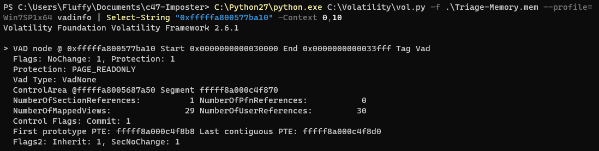

# DumpMe - Write-up
I would like to present a write-up of challenge DumpMe, which was available at [CyberDefenders](https://cyberdefenders.org/). During some research I found, that exactly the same task was at Defcon 2019 DFIR CTF.

**Requirements**: \
**Operating System**: Windows 10 \
**Tools**: [Volatility2](https://github.com/volatilityfoundation/volatility), Strings (from [Sysinternals](https://docs.microsoft.com/en-us/sysinternals/downloads/))

## 	1. What is the SHA1 hash of Triage-Memory.mem (memory dump)?

After downloading attachment, I unziped it. Then I launched Powershell and calculated hash with `Get-FileHash` function.

` Get-FileHash .\Triage-Memory.mem -Algorithm SHA1 | Format-List`

It calculated that SHA-1 was `C95E8CC8C946F95A109EA8E47A6800DE10A27ABD`.

## 2. What volatility profile is the most appropriate for this machine? (ex: Win10x86_14393)
To start working with Volatility, I needed to install Python 2.7. To get information about profile of this image, I used plugin `imageinfo`. The suggested profile was `Win7SP1x64`.

`C:\Python27\python.exe C:\Volatility\vol.py imageinfo -f .\Triage-Memory.mem`

## 3. What was the process ID of notepad.exe?
To find out I used plugin `pstree` to list all of processes as a tree. 

`C:\Python27\python.exe C:\Volatility\vol.py -f .\Triage-Memory.mem --profile=Win7SP1x64 pstree`

The PID of notepad.exe was `3032`.

## 4. Name the child process of wscript.exe.
Using the same command as above, I was looking for `wscript.exe` process. It was located few lines above previous found `notepad.exe`. 

The child of this process was `UWkpjFjDzM.exe`

## 5. What was the IP address of the machine at the time the RAM dump was created?
This time I used plugin `netscan`. I was looking for some local IP addresses associated with internal services, like `svchost.exe`, `System` etc. The IP of the machine was `10.0.0.101`.

`C:\Python27\python.exe C:\Volatility\vol.py -f .\Triage-Memory.mem --profile=Win7SP1x64 netscan`

## 6. Based on the answer regarding the infected PID, can you determine the IP of the attacker?
I was looking for a procces called `UWkpjFjDzM.exe`, so I used a Powershell function `Select-String`, which is equivalent of `grep` in *nix systems. The IP of the attacker was `10.0.0.106`.

`C:\Python27\python.exe C:\Volatility\vol.py -f .\Triage-Memory.mem --profile=Win7SP1x64 netscan | Select-String "UWkpjFjDzM.exe"`

## 7. How many processes are associated with VCRUNTIME140.dll?
This time I used plugin `dlllist`, which prints all of loaded dlls for each process. Then I used `Select-String` to find all of dll I was looking for and counted them. There was `5` of them with `Measure-Object`.

`C:\Python27\python.exe C:\Volatility\vol.py -f .\Triage-Memory.mem --profile=Win7SP1x64 dlllist | Select-String "VCRUNTIME140.dll" | Measure-Object`

## 8. After dumping the infected process, what is its md5 hash?
I used `procdump` plugin with flags:
 - `--dump-dir` - a directory where processes should be dumped
 - `-p` - it allows to specify which process to dump by its PID.

`C:\Python27\python.exe C:\Volatility\vol.py -f .\Triage-Memory.mem --profile=Win7SP1x64 procdump --dump-dir .\Process-dump\ -p 3496`

But there was a problem, because Microsoft Defender treated this as a virus and deleted file. So I added a folder with my project to scanning exceptions and dumped process again. Then I used `Get-FileHash` to calculate MD5 of process.

`Get-FileHash .\Process-dump\executable.3496.exe -Algorithm MD5 | Format-List`

The hash was `690EA20BC3BDFB328E23005D9A80C290`.

## 9. What is the LM hash of Bob's account?
To get LM/NTLM hashes I used 'hashdump' plugin.

`C:\Python27\python.exe C:\Volatility\vol.py -f .\Triage-Memory.mem --profile=Win7SP1x64 hashdump`

The LM hash of Bob's account was `aad3b435b51404eeaad3b435b51404ee`

## 10. What memory protection constants does the VAD node at 0xfffffa800577ba10 have?
I used `vadinfo` plugin to find all info about VAD nodes. There was a lot of them, so I filtered them by string `0xfffffa800577ba10`. There was a pattern of this, that for each VAD node was 11 lines of information, so I used flag `Context 0,10` to show 0 lines above and 10 lines below found string.

`C:\Python27\python.exe C:\Volatility\vol.py -f .\Triage-Memory.mem --profile=Win7SP1x64 vadinfo | Select-String "0xfffffa800577ba10" -Context 0,10`

The protection was `PAGE_READONLY`.

## 11. What memory protection did the VAD starting at 0x00000000033c0000 and ending at 0x00000000033dffff have?
In the same way as above I filtered all the data.

`C:\Python27\python.exe C:\Volatility\vol.py -f .\Triage-Memory.mem --profile=Win7SP1x64 vadinfo | Select-String "Start 0x00000000033c0000 End 0x00000000033dffff" -Context 0,10`

The protection was `PAGE_NOACCESS`.

## 12. There was a VBS script that ran on the machine. What is the name of the script? (submit without file extension).
Started looking for files that were executed, but none was presented. I was checking all of possible extensions for VBS scripts.

` C:\Python27\python.exe C:\Volatility\vol.py -f .\Triage-Memory.mem --profile=Win7SP1x64 filescan | Select-String -Pattern '(.*\.vbs|.*\.vbe|.*\.wsf|.*\.wsc)'`

So my next idea was to check, if it was run by cmdline.

` C:\Python27\python.exe C:\Volatility\vol.py -f .\Triage-Memory.mem --profile=Win7SP1x64 cmdline | Select-String -Pattern '(.*\.vbs|.*\.vbe|.*\.wsf|.*\.wsc)'`

There was only one VBS script run - `vhjReUDEuumrX.vbs`

## 13. An application was run at 2019-03-07 23:06:58 UTC. What is the name of the program? (Include extension)
To find this I used plugin `timeliner` and filtered all output with date.

`C:\Python27\python.exe C:\Volatility\vol.py -f .\Triage-Memory.mem --profile=Win7SP1x64 timeliner | Select-String "2019-03-07 23:06:58"`

There was only one application run at that time - `Skype.exe`.

## 14. What was written in notepad.exe at the time when the memory dump was captured?
At first I checked what PID of `notepad.exe` was. 

`C:\Python27\python.exe C:\Volatility\vol.py -f .\Triage-Memory.mem --profile=Win7SP1x64 pstree | Select-String "notepad.exe"`

It printed `3032`, so I wanted to use `memdump` plugin to get addressable dump memory from this process.

`C:\Python27\python.exe C:\Volatility\vol.py -f .\Triage-Memory.mem --profile=Win7SP1x64 memdump --pid 3032 --dump-dir .\Process-dump\`

Then I downloaded Sysinternals to use `strings.exe`, because Windows has not got built anything like that. In answer format I could see that there will be `flag<something>`. I decided to look for that string, because there were found too many of them to analyze all.

`C:\Sysinternals\strings.exe .\Process-dump\3032.dmp | Select-String -Pattern 'flag<.*>'`

It returned `flag<REDBULL_IS_LIFE>`

## 15. What is the short name of the file at file record 59045?

I decided to look for entries in MFT. I used at first `mftparser` to see how the results were printed. After analyzing that, I searched for this file.

`C:\Python27\python.exe C:\Volatility\vol.py -f .\Triage-Memory.mem --profile=Win7SP1x64 mftparser | Select-String "Record number: 59045" -Context 3,22`

It found 2 links. The shorter one was `EMPLOY~1.XLS`

## 16. This box was exploited and is running meterpreter. What was the infected PID?

And for last task I scanned all processes with `psscan`.

`C:\Python27\python.exe C:\Volatility\vol.py -f .\Triage-Memory.mem --profile=Win7SP1x64 psscan`

There was one odd process name, which had to be infected - `3496`.

