# Bezpieczeństwo aplikacji webowych
# Projekt 1 - zadanie 1

W ramach pierwszego projektu mieliśmy rozwiązać 2 zadania stworzone przez Jakuba "Unknown" Mrugalskiego. Poniżej znajdują się linki do nich:

[zadanie 1](https://uw-team.org/hackme/)

[zadanie 2](https://uw-team.org/hm2/)

W tym pliku znajduje się rozwiązanie do zadania 1, natomiast rozwiązanie do zadania 2 jest w następnym pliku.

## Zadanie 1
Po wejściu na główną stronę, została wyświetlona bardzo prosta aplikacja webowa. Posiadała ona jedynie pole do wpisania hasła dostępu.

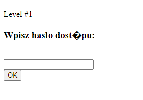

Zacząłem od wpisania dowolnych znaków, aby sprawdzić jak aplikacja się zachowa. Lecz za każdym razem wyświetlany był jedynie komunikat o błędnym haśle.


Zabrałem się za zebranie podstawowych informacji o stronie. Na początku wyświetliłem źródło strony za pomocą klawiszy `Ctrl+U`. W nowej karcie otworzył się plik HTML, który zawierał kod strony.

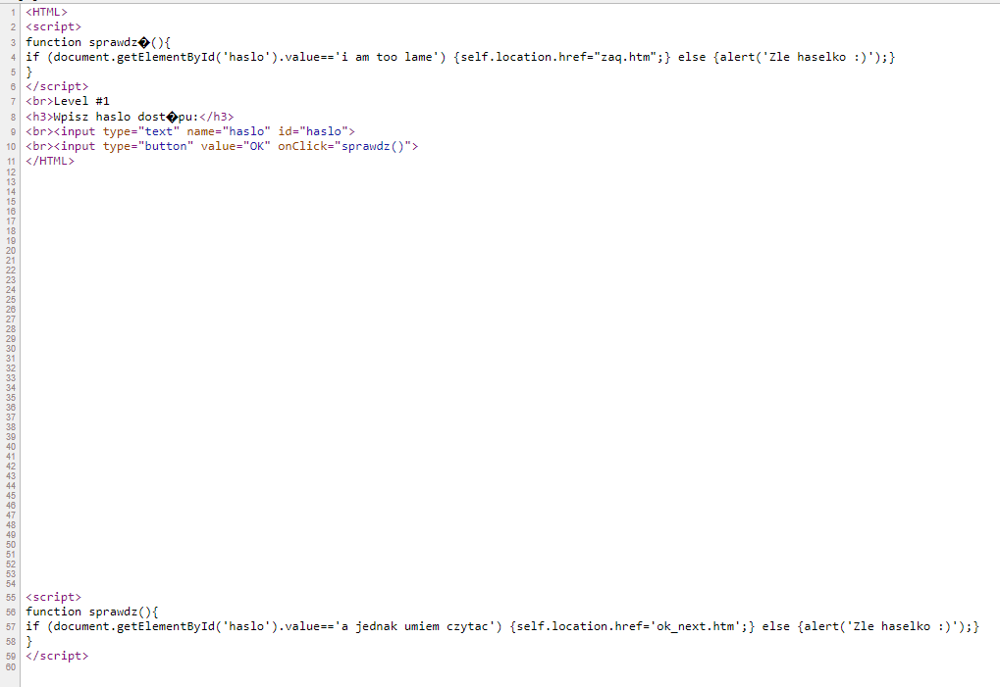

W linijkach 55-59 został napisany prosty skrypt, którego zadaniem było wychwycenie odpowiedniego ciągu znaków wpisanego w dostępne pole na stronie. Udało mi się z niego dowiedzieć, że wymaganym ciągiem znaków był `a jednak umiem czytac`, ponieważ to był ciąg znaków, który był porównywany z tym co zostało wpisywane na stronie. Po wpisaniu tego hasła, zostałem przekierowany do następnego poziomu.

Interfejs kolejnego poziomu wyglądał tak samo jak w przypadku poprzedniego poziomu.

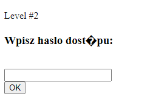

Ponownie zacząłem od sprawdzenia kodu strony w taki sam sposób jak opisałem wcześniej.

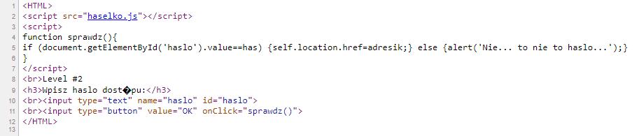

Tym razem w linijce 2 można zauważyć, że aplikacja korzysta ze skryptu napisanego w JavaScripcie. Na pierwszy rzut oka nie znalazłem nic ciekawszego w kodzie strony, więc postanowiłem sprawdzić co znajduje się w skrypcie `haselko.js`, do którego link znajduje się w 2 linijce kodu strony. Po kliknięciu na odnośnik, zostałem przekierowany do nowej karty z treścią pliku.

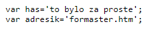

W pliku były wpisane dwie zmienne: `has` oraz `adresik`. Wróciłem do analizy kodu źródłowego strony, aby sprawdzić, w którym miejscu aplikacja korzysta z tych zmiennych. 
W 4 linijce została zdefiniowana funkcja `sprawdz()`

```
function sprawdz(){
if (document.getElementById('haslo').value==has) 
{self.location.href=adresik;} 
else 
{alert('Nie... to nie to haslo...');}
}
```

Można zauważyć, że aplikacja porównuje wpisany ciąg znaków z wartością zapisaną w zmiennej `has`. Wartość tej zmiennej została zdefiniowana w pliku `haselko.js`, więc wpisałem ją jako hasło w aplikacji. Po wpisaniu `to bylo za proste` zostałem przekierowany do poziomu 3.

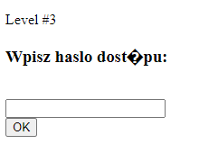

Ponownie rozpocząłem od sprawdzenia kodu źródłowego strony.

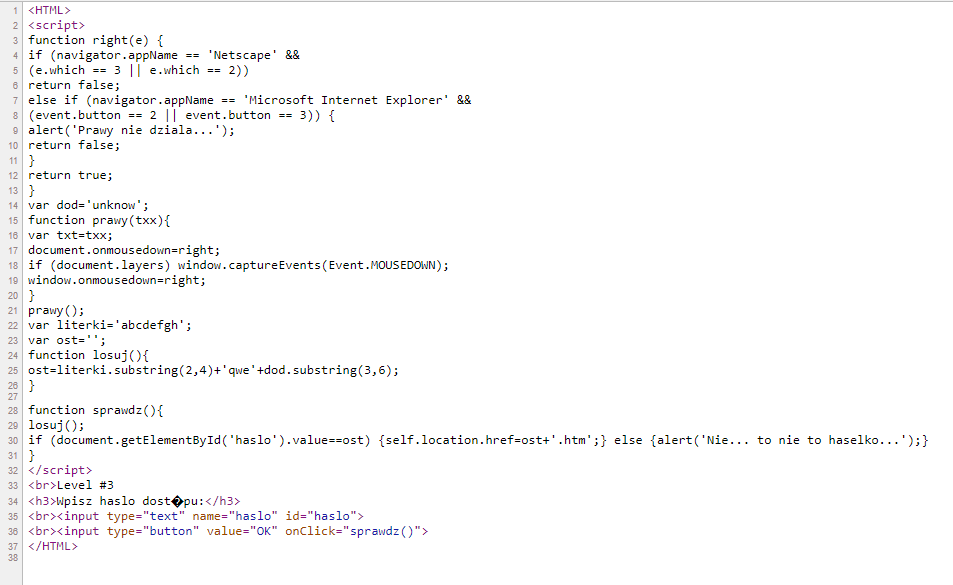

Tym razem aplikacja posiadała bardziej zaawansowany skrypt niż w poprzednich poziomach.
W linijce 30 możemy zauważyć, że wpisany ciąg znaków, będzie porównywany z wartością ze zmiennej `ost`. Zmienna `ost` została zdefiniowana oraz przypisana jej wartość w funkcji `losuj()` w linijce 24.

```
function losuj(){
ost=literki.substring(2,4)+'qwe'+dod.substring(3,6);
}
```

Z tego można wywnioskować, że szukany ciąg znaków będzie składał się z 3 części:
- literki.substring(2,4) 
- ciągu znaków `qwe`
- dod.substring(3,6) 

Funkcja `substring` wydobywa ciąg znaków z tekstu nie zmieniając jego pierwotnej wartości. Do jej działania wymagane jest podanie liczby od której powinien zacząć czytać tekst (liczonej od 0) i ewentualnie drugiej liczby określającej dokąd powinien wydobyć znaki (nie wliczając ostatniego znaku).

W związku z czym, jeżeli zmienna `literki` posiada wartość `abcdefgh` (przypisane w 22 linijce), to czytając od 2 znaku do 4 otrzymamy znaki `cd`. To samo należy zrobić z danymi w zmiennej `dod` (przypisanie w 14). W efekcie otrzymałem hasło `cdqwenow`, które było poprawne.

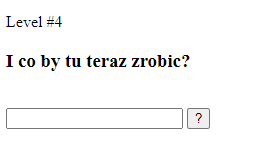

Ponownie rozpocząłem od sprawdzenia źródła strony.

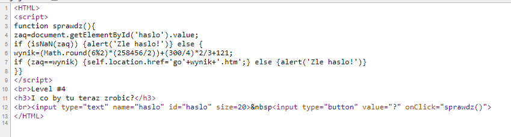

Zauważyłem, że hasłem będzie wynik zadania matematycznego w zmiennej `wynik`.
Funkcja `Math.round()` zaokrągla liczbę do najbliższej liczby całkowitej. Argumentem w niej jest wynik z dzielenia z resztą (modulo). Wynik z dzielenia liczby 6 modulo 2 jest 0, następnie jest ono zaokrąglone do najbliższej liczby całkowitej, czyli do 0. Nie musiałem dzielić `258456/2`, ponieważ cokolwiek pomnożone przez 0, daje wynik 0, więc mogłem przejść do następnej części tego działania. Wykonałem następne operacje arytmetyczne i wyszedł mi wynik `171`, który był hasłem w tym zadaniu.

W poziomie 5 zmieniała się liczba w zamku czasowym.

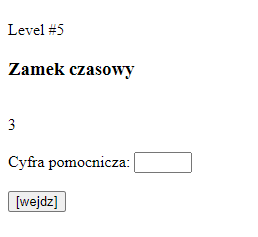

Tutaj również rozpocząłem od sprawdzenia źródła strony.

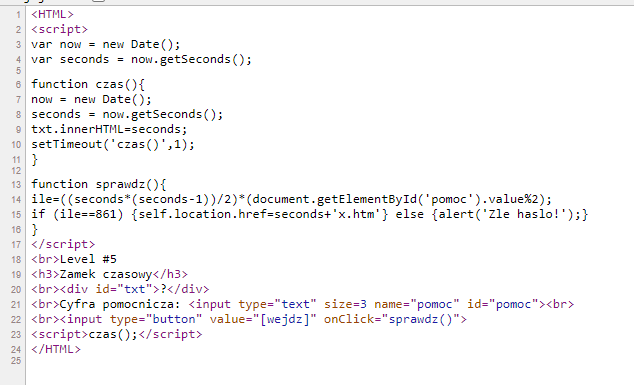

W funkcji `sprawdz()` można zauważyć, że do rozwiązania tej zagadki będzie wymagana odpowiednia liczba sekund wyświetlona na ekranie oraz wpisania cyfra pomocnicza. W linijce 15 widzimy, że aby hasło było poprawne wynik musi być równy 861. Drugim czynnikiem mnożenia w zmiennej `ile` jest `(document.getElementById('pomoc').value%2)`. Tak jak w poprzednim przypadku mamy tutaj do czynienia z dzieleniem modulo. Aby nie wyzerować iloczynu, jako `cyfrę pomocniczą` musimy wpisać dowolną liczbę nieparzystą, ponieważ wynik z ich dzielenia modulo 2 będzie zawsze 1. Teraz trzeba się zająć pierwszym czynnikiem `(seconds*(seconds-1)/2))`. Wiemy, że wynik tego mnożenia ma być równy 861, więc możemy wykonać działania odwrotne do czynnika pierwszego. Czyli możemy najpierw pomnożyć `861 * 2 = 1722`. Teraz trzeba tylko znaleźć parę liczb, która jedna z nich jest mniejsza o 1 od drugiej i której iloczyn będzie wynosił 1722. Metodą prób i błędów udało się je znaleźć. Są to liczby 42 i 41, w związku z czym w 42 sekundzie należy wpisać cyfrę pomocniczną np. 1 (musi być nieparzysta) i kliknąć `[wejdz]`.

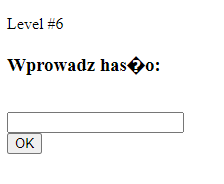

Również rozpocząłem od sprawdzenia kodu źródłowego strony.

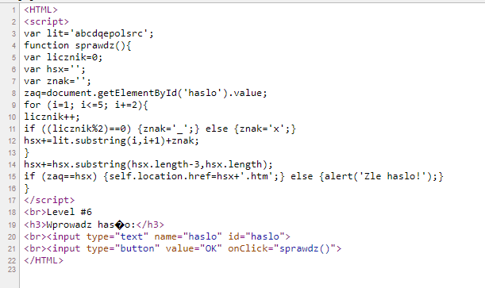

Analizę skryptu można rozpocząć od pętli w 9 linijce. Widać, że inicjalizowany był iterator `i` o wartości `1`, polecenia w pętli będą wykonywane tak długo, jak `i` będzie mniejsze lub równe `5`, oraz po każdej iteracji zmienna `i` będzie powiększana o 2. 
Działania w pętli to: 
- zwiększana jest wartość zmiennej `licznik` o 1.
- jeżeli wartość `licznik` modulo 2 jest równe 0, to:
    - zmienna `znak` jest równa `_`
    - zmienna `znak` jest równa `x`
- do zmiennej `hsx` dodawana jest litera ze zmiennej `lit` z pozycji o numerze `i` oraz wartość zmiennej `znak`

W tabeli poniżej przedstawione zostały poszczególne zmiany zmiennych w pętli.

| Iteracja | i | licznik | znak | lit.substring | hsx    |
|:--------:|:-:|:-------:|------|---------------|--------|
|     1    | 1 |    1    | x    | b             | bx     |
|     2    | 3 |    2    | _    | d             | bxd_   |
|     3    | 5 |    3    | x    | e             | **bxd_ex** |

Kolejnym poleceniem po wyjściu z pętli jest dodanie do zmiennej `hsx` ciągu 3 ostatnich znaków ze zmiennej `hsx`. 
A więc na obecną chwilę zmienna `hsx` jest równa `bxd_ex`, więc ostatnimi trzema znakami będą `_ex`, to po dodaniu ich nowa wartość zmiennej `hsx` będzie równa `bxd_ex_ex`. To było poprawne hasło.

Ukazał się 7 poziom.

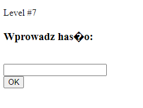

Ponownie zacząłem od sprawdzenia źródła strony.

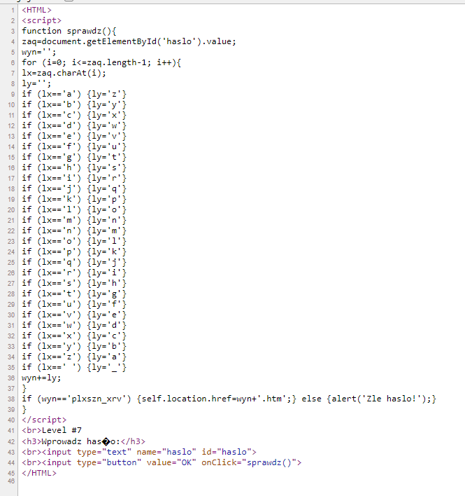

Zadaniem funkcji `sprawdz()` jest zamiana poszczególnych znaków na te zdefiniowane w `ly`. W linijce 38 można zaauważyć hasło, które jest po przemianie, więc moim zadaniem było odwrócenie tego ciągu `plxszn_xrv` zgodnie z zasadami, które są określone w pętli, która została zdefiniowana w linijkach 6-37. A więc zamieniając znak po znaku, czyli `p` zamienia się w `k`, `l` w `o` itd. otrzymujemy hasło `kocham cie`, które było poprawne.

Ostatnim poziomem w tej części był poziom 8.

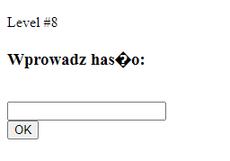

Ponownie rozpocząłem od sprawdzenia kodu źródłowego strony.

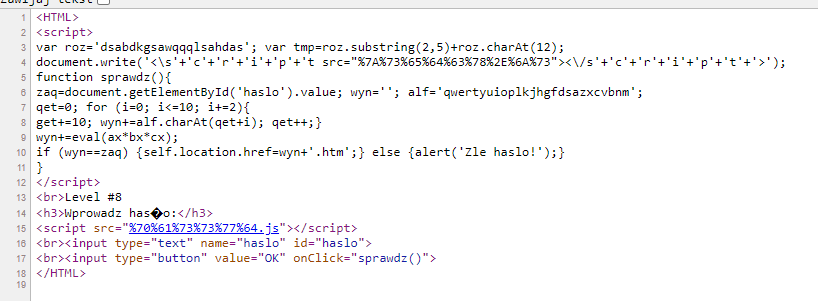

Analizując od początku 3 linijkę, widzimy zdefiniowanie 2 zmiennych `roz` i `tmp`. 
`tmp` składa się z 3 liter ze zmiennej `roz` oraz z 12 znaku (liczonego od 0) również ze zmniennej `roz`, czyli jest równa `abdl`.

Następnym elementem jest załadowanie skryptu, który znajduje się pod adresem `%7A%73%65%64%63%78%2E%6A%73`. To jest treść zakodowana za pomocą kodowania URL, więc należy skorzystać z narzędzia do zamiany reprezantacji znaków, np. za pomocą CyberChef. Po zdekodowaniu plik nazywa się `zsedcx.js`. 

Sprawdziłem jego zawartość, wpisując nazwę pliku w URL po `/hackme/` ponieważ, zgodnie z zasadami definiowania ścieżek względnych, tam będzie się on znajdował.

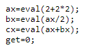

Definiuje on 4 zmienne. Funkcja `eval()` wykonuje lub oblicza to co zostanie jej podane jako argument. Jest to bardzo niezalecana funkcja w aplikcjach webowych i należy jej zdecydowanie unikać. Niemniej jednak, wartości zmiennych w skrypcie to:
- ax = 6
- bx = 3 
- cx = 9
- get = 0

Analizując działania w pętli można zauważyć że:
- iterator `i` jest równy 0
- będzie ona wykonywana aż `i` będzie mniejsze lub równe niż 10
- w każdej iteracji wartość `i` będzie zwiększana o 2
- do zmiennej `get` zostanie dodane 10
- do zmiennej `wyn` zostanie dodany znak z pozycji (`qet` + `i`)
- zmienna `qet` zostanie zwiększona o 1

Poszczególne iteracje zostały zamieszczone w poniższej tabeli.

| Iteracja |  i | get | qet |   wyn  |
|:--------:|:--:|:---:|:---:|:------:|
|     1    |  0 |  10 |  0  |    q   |
|     2    |  2 |  20 |  1  |   qr   |
|     3    |  4 |  30 |  2  |   qru  |
|     4    |  6 |  40 |  3  |  qrup  |
|     5    |  8 |  50 |  4  |  qrupj |
|     6    | 10 |  60 |  5  | qrupjf |

Następnie do zmiennej `wyn` ma zostać dołączony iloczyn zmiennych `ax`, `bx` i `cx` czyli 162. Ostatecznie hasło to `qrupjf162`.

Po wpisaniu tego hasła dostałem informację o ukończeniu tej gry.

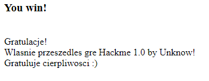