# Bezpieczeństwo aplikacji webowych
# Projekt 1 - zadanie 2 

Drugim zadaniem było przejście gry dostępnej pod [tym adresem](http://uw-team.org/hm2/).

Po wejściu na stronę rozpocząłem grę.
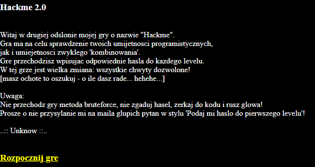

Pierwszy poziom wyglądał tak jak poniżej.

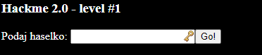

Tak jak w przypadku pierwszej gry, zacząłem od sprawdzenia kodu źrodłowego strony.

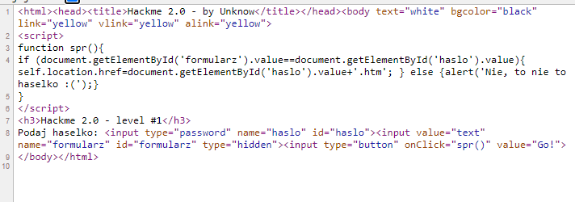

W 8 linijce widoczny jest jakiś ukryty formularz, ponieważ posiada atrybut `type="hidden"`. Przeszedłem więc do strony, kliknąłem prawym przyciskiem na stronie, nastepnie zbadałem element i usunąłęm ten atrybut.

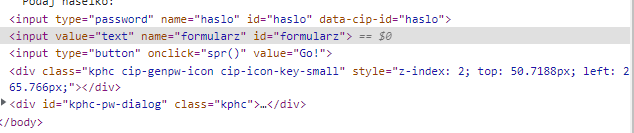

Na stronie pokazał się kolejny formularz, który posiadał domyślnie treść `text`.

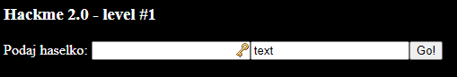

Ze skryptu dostępnego na stronie w linijce 4, można wywnioskować, że jest sprawdzane, czy tekst z pola o `id` `formularz` będzie równa treści z pola o `id` równego `haslo`. Przepisałem więc hasło `text` do pola z hasłem i udało mi się przejść do drugiego poziomu.

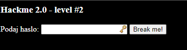

Sprawdziłem zawartość strony.

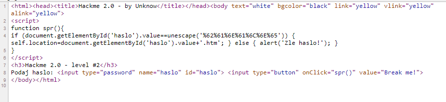

Funkcja `unescape()` zamienia reprezentację znaków z heksadecymalnej na UTF-8, która jest bardziej przyjazna do czytania. Należy wspomnieć, że ta funkcja nie jest już zalecana i zamiast niej, należy korzystać z `decodeURI()`. W związku z czym, skorzystałem z narzędzia CyberChef do zamiany tego ciągu `%62%61%6E%61%6C%6E%65` na UTF-8. Po zamianie, wpisałem hasło `banalne`, które było poprawne i przeszedłem do 3 poziomu.

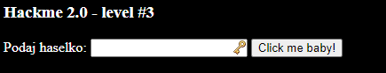

Ponownie pierwsze co zrobiłem, to sprawdziłem źródło strony.

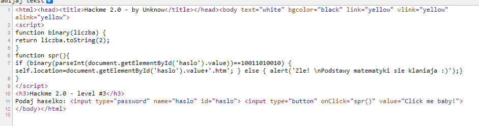

Funkcja w 3 linijce `binary()` zamienia otrzymany ciąg znaków na reprezentację binarną. W 7 linijce można zauważyć funkcję `parseInt`, która zamienia wpisany ciąg na liczbę typu integer. Na tej podstawie stwierdziłem, że muszę znaleźć liczbę, której reprezentacja binarna to `10011010010`. Użyłem więc kalkulatora i zamieniłem ją na liczbę heksadecymalną. Wynikiem było `1234`, które było poprawnym hasłem.

Po przejściu do następnego poziomu, pojawił się poniższy komunikat ze strony.

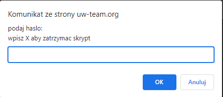

Nie dało się kliknąć prawym przyciskiem na ekran, aby wyświetlić źródło strony, więc skorzystałem ze skrótu klawiaturowego `Ctrl+U`. Jeżeli on by nie zadziałał, to można również dopisać w na początku URL `view-source:`, efekt będzie taki sam.

W pierwszych 124 linijkach nic nie było. Treść strony dopiero zaczynała się od 125 linijki.

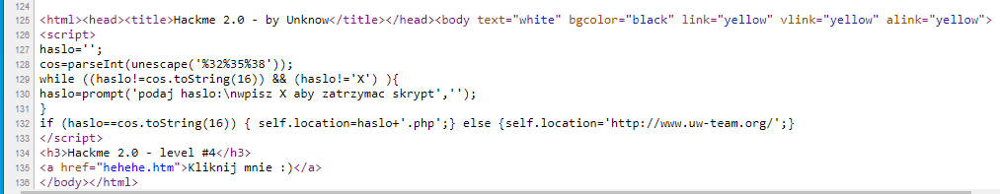

Zacząłem od zamiany ciągu znaków `%32%35%38` na reprezentację UTF-8, który wynosi `258`. Następnie w 132 linijce jest napisane, że ten ciąg znaków powinien być zamieniony na reprezentację szesnastkową. Więc skorzystałem ponownie z narzędzia CyberChef i zamieniłem. Hasłem końcowym była liczba `102`.

Pokazał mi się 5 poziom.

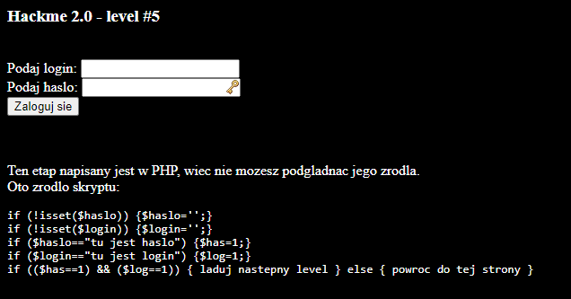

Tym razem zgodnie z informacją napisaną na stronie, etap jest napisany w PHP, więc zabrałem się za analizę skryptu.

Aby można było przejść do następnego poziomu zmienna `has` powinna być równa `1` i zmienna `log` też powinna być `1`. Jednak na stronie nie ma nigdzie miejsca, w którym wpisuje się dane do zmiennych `has` i `log`. W języku PHP wartości zmiennych przekazuje się po znaku `?` na końcu adresu URL. Więc dopisałem je ręcznie do adresu URL wraz z `1`. Nie wpisywałem żadnego hasła ani loginu. Końcowy adres URL wyglądał nastepująco:

- `https://uw-team.org/hm2/102.php?log=1&has=1`

Po wpisaniu tego adresu URL, pojawiła się informacja o udanym przejściu zadania.

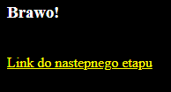

Pojawił się ekran zadania 6, w którym zostałem poinformowany, że dostałem ciasteczko z wróżbą.

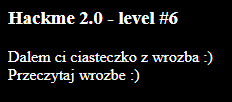

Uruchomiłem narzędzia deweloperskie (F12, lub prawy przycisk myszki w dowolnym miejscu na stronie i przycisk `Zbadaj`). Następnie przeszedłem do zakładki `Application`, `Cookies` i ciasteczka strony `https://uw-team.org`.

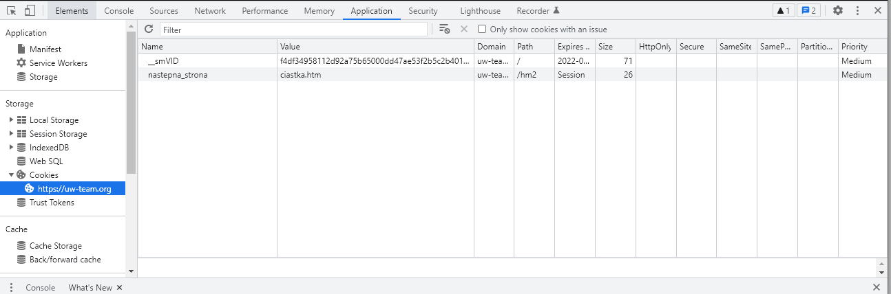

Jedno z ciasteczek miało nazwę `nastepna_strona`, a jego wartość wskazywała na `ciastka.htm`, które należało wpisać w adres URL, aby przejść do następnego etapu. Ostatecznie adres URL wyglądał nastepująco:

- `https://uw-team.org/hm2/ciastka.htm`

W ten sposób przeszedłem do 7 poziomu.

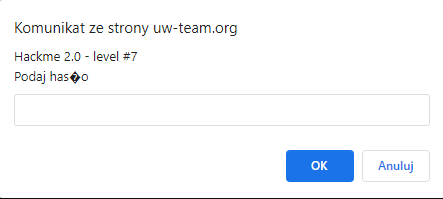

Po wpisaniu błędnego hasła, przekierowuje nas do strony, w której jest wskazówka, aby wykorzystać pewną funkcjonalność serwera Apache. Chodzi tutaj o możliwość wyświetlenia wszystkich plików w danym katalogu z poziomu przeglądarki. Jednak trzeba znać folder, do którego dowolny użytkownik posiada uprawnienia wyświetlania. 

Wróciłem do strony, którą wcześniej udało mi się znaleźć. Najłatwiejszym sposobem wyświetlenia źródła strony jest dopisanie `view-source:` przed URL, czyli:

- `view-source:https://uw-team.org/hm2/ciastka.htm`

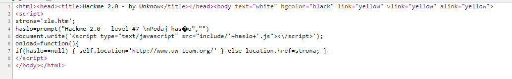

W 5 linijce zawarta jest informacja, że ładowane są ze skryptu w folderze `/include`, ale nie jest podana jego nazwa. Możemy tutaj wykorzystać wcześniej wspomnianą funkcjonalność serwera Apache i wyświetlić pliki w folderze `/include`. W związku z czym wpisałem w adres URL:

- `http://uw-team.org/hm2/include/`

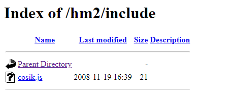

W folderze był 1 plik o nazwie `cosik.js`, więc sprawdziłem jego zawartość. W nim była tylko treść `strona='listing.php`, więc wpisałem w adresie URL:

- `https://uw-team.org/hm2/listing.php`

Niestety zaraz po wejściu na stronę otrzymujemy komunikat, że referentem musi być strona `www.onet.pl`. 

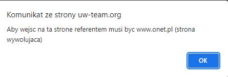

Po kliknięciu przycisku `OK` przekierowuje na na głowną stronę twórcy zadań. Natomiast zgodnie z regulaminem zadania, wszystkie chwyty dozwolone oprócz łamania haseł. Każda przeglądarka umożliwia zablokowanie uruchamiania skryptów na stronie. Można również doprecyzować do konkretnej strony, więc postanowiłem skorzystać z tej funkcjonalności. Przeszedłem do ustawień przeglądarki Chrome, wpisałem `JavaScript` i wszedłem do panelu zarządzania tym elementem. Zablokowałem możliwość uruchamia skryptów na stronie `https://uw-team.org/hm2/listing.php`.

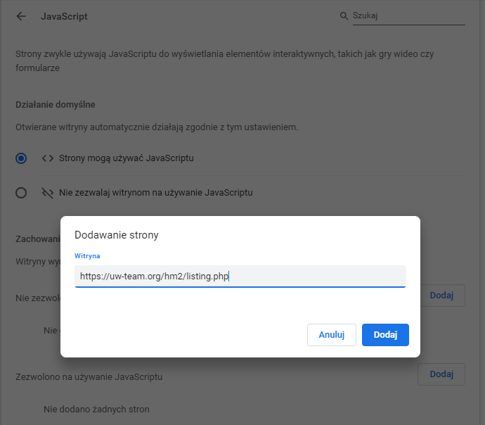

Dzięki temu byłem w stanie uruchomić stronę.

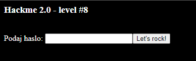

Przeszedłem więc do sprawdzenia źródła strony.

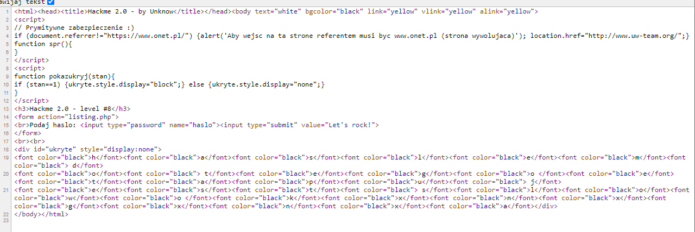

W linijce 18 można zauważyć, że dodano atrybut `style= "display:none"`. Oznacza on, że element na stronie nie jest wyświetlany. Więc postanowiłem usunąć ten element, abym mógł sprawdzić co się kryje tam dokładnie. 

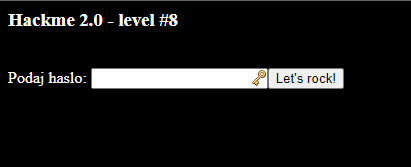

Na pierwszy rzut oka nie zmieniło się nic. Natomiast analizując dalej kod źródłowy strony widać, że te elementy posiadają czarny kolor czcionki na czarnym tle, więc są one niewidoczne dla użytkownika. Po zaznaczeniu całej zawartości strony (np. za pomocą skrótu klawiszowego Ctrl+A), dostajemy informację, że hasłem jest `kxnxgxnxa`

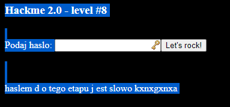

Po wpisaniu hasła, dostajemy informację, że następny etapik jest ukryty w pliku `pokaz.php`.

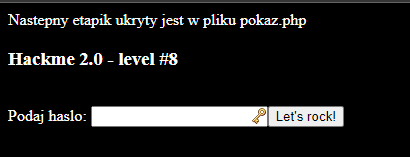

Pamiętając zasadę działania przesyłania argumentów do skryptów napisanych w języku PHP (po znaku ? w URL), zmieniłem nazwę pliku w URL z `listing.php` na `pokaz.php` i przeszedłem do poziomu 9.

- `https://uw-team.org/hm2/pokaz.php?haslo=kxnxgxnxa`

Pojawił się znowu komunikat, który zablokował mi dostęp do strony.

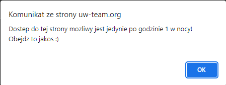

Jednak tak samo jak w poprzednim przypadku, wystarczy zablokować możliwość uruchamiania skryptów w JavaScripcie. Po zablokowaniu uruchomiła się strona z poziomem 9.

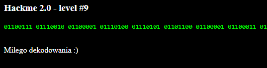

Można było zauważyć jakiś tekst zakodowany binarnie. Skorzystałem z narzędzia CyberChef do zdekodowania tego ciągu znaków. Po zamianie, otrzymałem `gratulacje! udało Ci się ukończyć te wersje Hackme.`