# Disk Analysis & Autopsy - Write up
I would like to present my write-up [Disk Analysis & Autopsy](https://tryhackme.com/room/autopsy2ze0) available at TryHackMe. To solve this challenge I used prepared machine by author, which had already run Ingest Modules.

At first I have loaded the image, as was said in the description.

## 1. What is the MD5 hash of the E01 image? 
I run `View Summary Information`

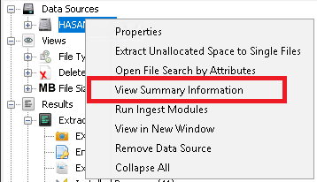

And then I looked at calculated MD5 hash in `Container`.

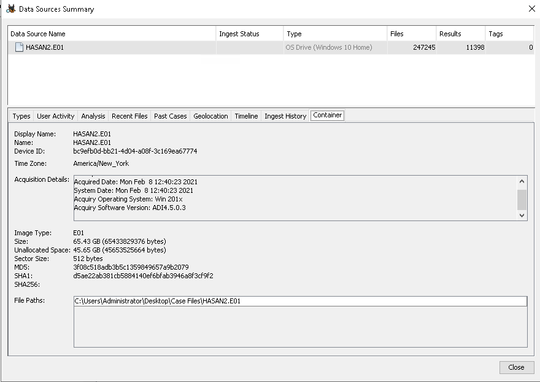

The hash was `3f08c518adb3b5c1359849657a9b2079`.

## 2. What is the computer account name?
In `Operating System Information` I could find the computer account name - `DESKTOP-0R59DJ3`

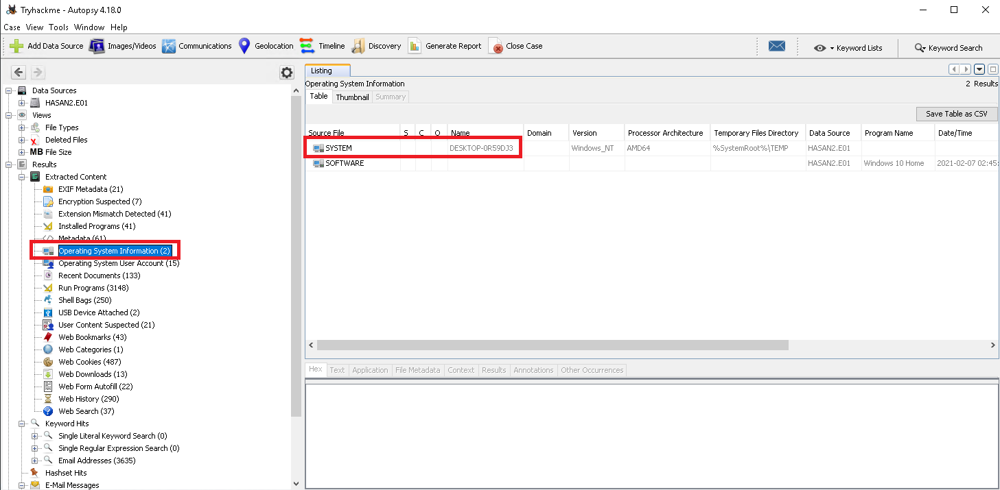

## 3. List all the user accounts. (alphabetical order)
All the user accounts I could find in `Operating System User Account` from the `SAM`. `Administrator` and `Guest` accounts were built-in and disabled in `Account Settings` column.

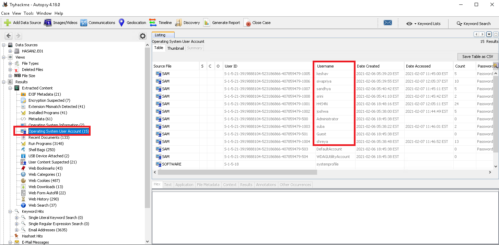

All 7 user accounts in alphabetical order were `H4S4N,joshwa,keshav,sandhya,shreya,sivapriya,suba`

## 4. Who was the last user to log into the computer?

From the same place as previous, I could find the user, that was last logged in - `sivapriya`.

## 5. What was the IP address of the computer?

I started analyzing `Installed Programs`. I found `Look@LAN` which is tool to analyze network.
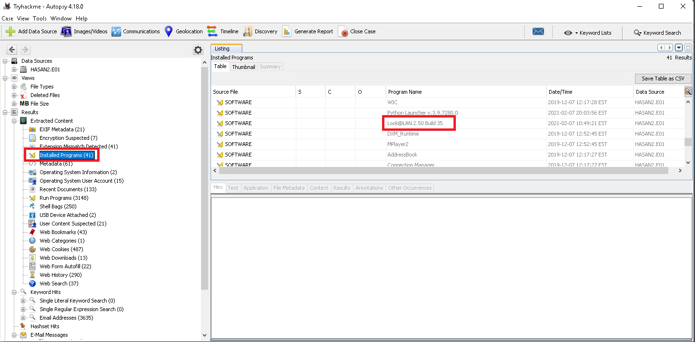

So I entered to the folder of this program to check `vol3/Program Files(x86)/Look@LAN/irunin.ini`, which stored information about address IP of the machine. It was 192.168.130.216.

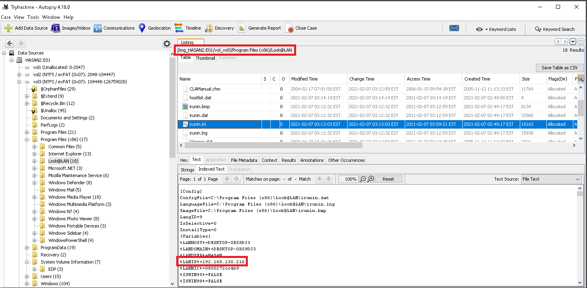
## 6. What was the MAC address of the computer? (XX-XX-XX-XX-XX-XX)

In the same file located was the MAC address of this computer in `LANNIC` - `08-00-27-2c-c4-b9`

## 7. What is the name of the network card on this computer?
I started `Keyword Search` and looking for `Ethernet`. I started analyzing files one by one, where I could find some obvious answer. The name of the network card was `Intel(R) PRO/1000 MT Desktop Adapter`.

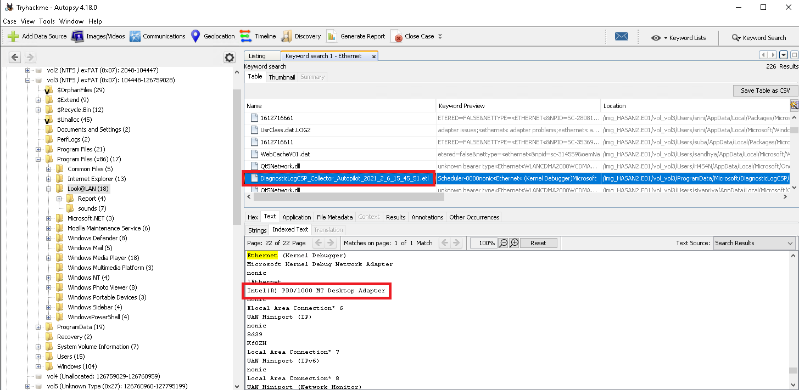

## 8. What is the name of the network monitoring tool?
This is program, from which I found answers in questions 5 and 6 - `Look@LAN`

## 9. A user bookmarked a Google Maps location. What are the coordinates of the location?

In `Web Bookmarks` I found one bookmarked Google Maps. The coordinates were `12°52'23.0"N 80°13'25.0"E`

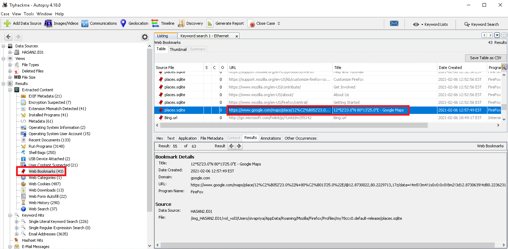

## 10. A user has his full name printed on his desktop wallpaper. What is the user's full name?
I used `Image/Video Gallery` to print all images stored in disk. After a while of looking in all pictures, I thought that User could download his wallpaper. I checked folder `Downloads` of each user and all pictures stored there. There was image from Cyberpunk 2077 with name written on, stored in user `joshwa`. His full name was `Anto Joshwa`
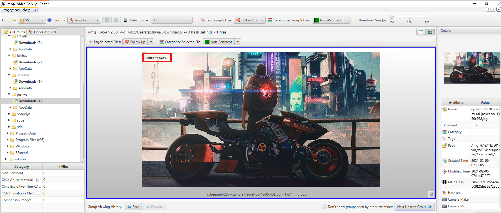

## 11. A user had a file on her desktop. It had a flag but she changed the flag using PowerShell. What was the first flag?
If the file was changed with Powershell, I used `Keyword Search` to look for file `ConsoleHost_history.txt`, which stored all ran powershell commands.
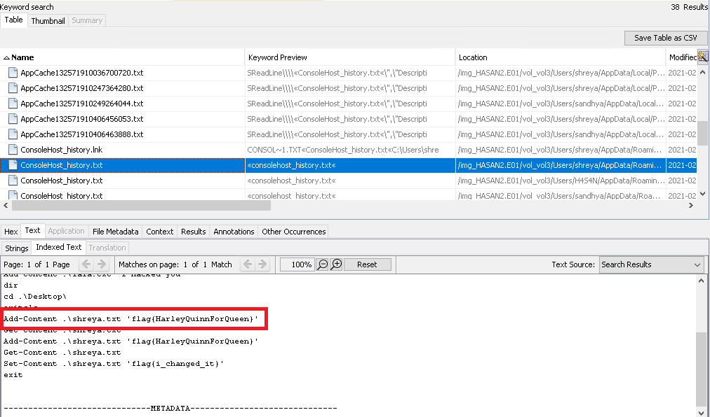

## 12. The same user found an exploit to escalate privileges on the computer. What was the message to the device owner?
In Dekstop of `shreya` was powershell script stored. In this file was flag, which would be added to file `hacked.txt`
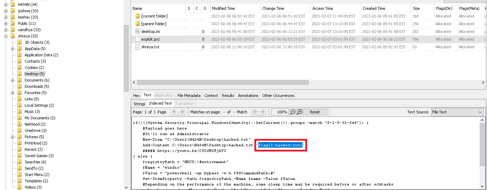

## 13. 2 hack tools focused on passwords were found in the system. What are the names of these tools? (alphabetical order)
I googled where are stored logs of offline scans. I found in `ProgramData/Microsoft/Windows Defender/Scans/History/Service/DetectionHistory` are being stored more information about threats. It included Mimikatz and Lazagne.
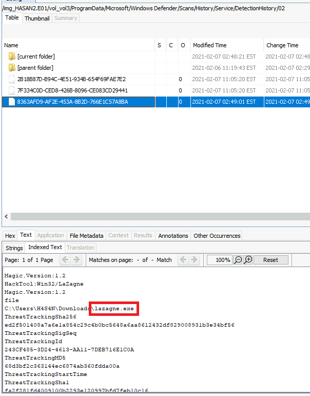
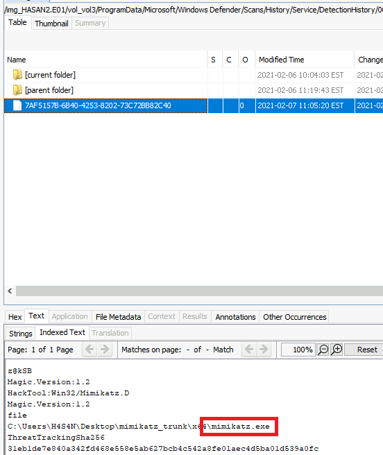

## 14. There is a YARA file on the computer. Inspect the file. What is the name of the author?
Because of a long time period of `Substring Search` of `.yar` files, I decided to look into `Recent Documents` found by Autopsy. I found link file to YARA file.

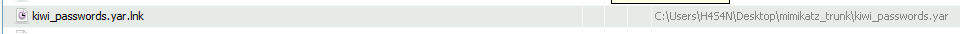

There was no such file on Desktop, so I looked into Downloads. An author was `Benjamin DELPY gentilkiwi`
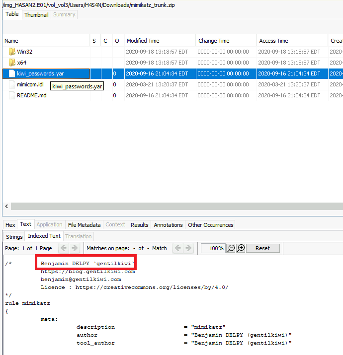

## 15. One of the users wanted to exploit a domain controller with an MS-NRPC based exploit. What is the filename of the archive that you found? (include the spaces in your answer) 
During first look up on `Recent Documents` I found one interesting file with `Zerologon` within. I decided to take a closer look. The name of archive where it was stored was `2.2.0 20200918 Zerologon encrypted.zip`
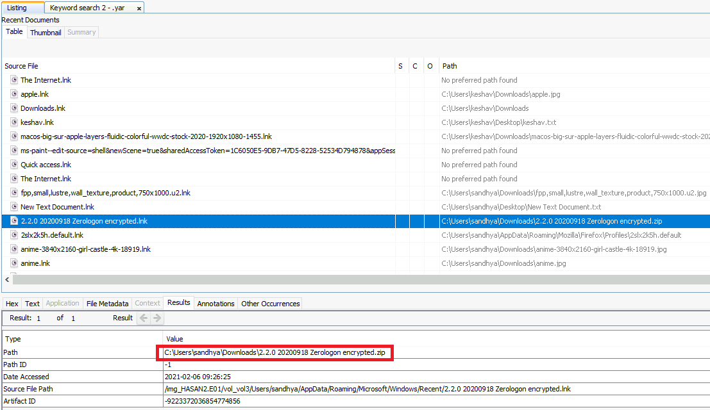

